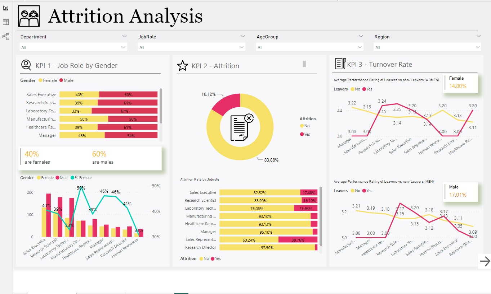
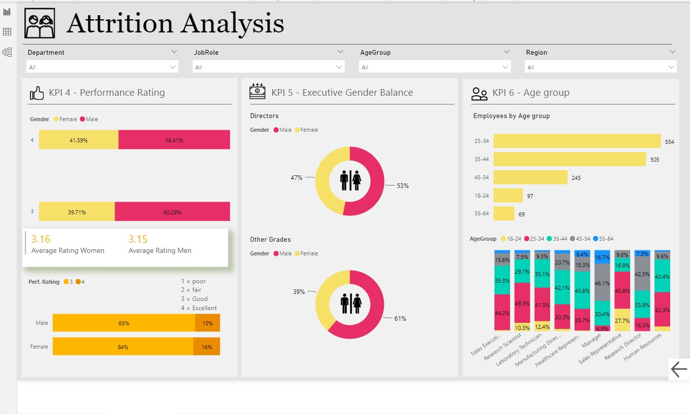
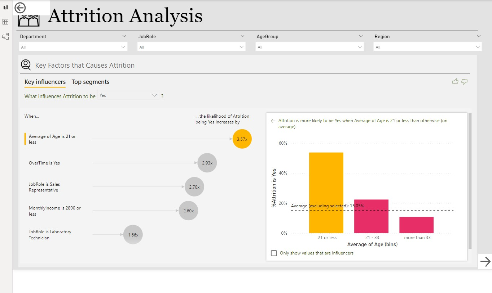

# HR-Attrition-Analysis

# Introduction

This dataset was gotten from kaggle.com. This analysis focuses on attrition. The data source is MS SQL server which was imported to power BI. A view was created on the SQL side to import only necessary columns & rows needed for this particular analysis. The Ms sql view table name is HR_Attrition_View while the other table was created in Power BI called Measure table that consists of all the Dax measures I used for this analysis.

# Problem Statement 

The aim of this analysis is to answer the following Business related questions

-  Identify key reasons why attrition rate is high within the organization?
-  Produce other key insights that will be useful to the HR Manager?
 
# Skills & Concept used:

- Use of SQL import & Export wizard
- Creating SQL Views
- Writing SQL Queries
- Adding new columns to the existing table using conditional statements in SQL
- ETL
- Data Architecture and Optimization
- GDPR (Data Protection)
- DAX Measures
- Data Visualization & Design (Using appropriate visuals to send appropriate message to stakeholders)

# Data Source:

An SQL View was created from MS SQL server database.

# Data Transformation/Cleaning/Manipulation:

Transformation took place in the SQL side and in Power BI using power query. Column quality/distribution was checked for nulls, values were replaced. 

# Data Modelling:

For this analysis only 1 table was used that contained all the necessary data needed for the data analysis as such there was no need for any data modelling.

# Data Visualization:

There were 3 visual pages presented. The visuals used consisted of cards, 100% stacked bar and clustered column chart, pie charts, Line charts ,key inflencers and different slicers. The slicers used are to make the dashboard an interactive one so as to answer different business problems based on the data presented.

# Insights:

- Attrition rate in the organization was 16.12%.
- The jobroles that had the highest attrition rates was Sales Representative at 39.76%, Laboratory Technician at 23.94% and Sales Executive at 17.48%.
- The attrition rate for Males was 17.01% and 14.80% for females.
- Performance ratings for female staff in research scientist role (3.24) & laboratory technician role 3.25) who left the organization was higher than the staff who currrently hold those positions. The current female staff rating for research scientist (3.15) and laboratory technician (3.14).
- Age groups between 25-54 dominatein different deparments & job roles than any other age group in the organization.
- From the analysis, Attrition rate tends to be high and staff tend to leave by (3.57 times) when their average age is "21 or less also if the job role is "Sales Rep", they are (2.70 times likely to leave) and when their monthly income is "£2800" then the likely hood of them leaving is (2.60 times).

 
